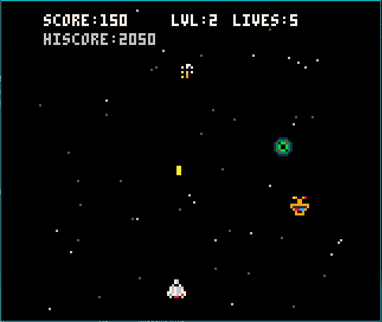

# 👾 Alien Attack (PICO-8)


Un **Arcade Vertical Shooter** desarrollado íntegramente en la "Fantasy Console" PICO-8. Este proyecto explora los límites de la optimización y el *game feel* bajo restricciones estrictas de memoria y resolución (128x128 px).

Combina mecánicas clásicas de *Bullet Hell* con patrones de enemigos procedurales y un sistema de jefe final con múltiples fases.


*(Asegúrate de subir una captura del juego a la carpeta 'screenshots')*

---

## 🎮 Jugar Ahora

Puedes jugar la versión Web (HTML5) directamente en tu navegador:

👉 **[Jugar Alien Attack Online](https://raulcamaracarreon.github.io/Alien-Attack-Pico8/)**

*(Controles: Flechas para mover, Z para disparar/aceptar, X para pausar/atrás)*

---

## 🚀 Características Técnicas

A pesar de las limitaciones de la consola, el juego implementa sistemas avanzados:

### 🧠 Máquina de Estados del Jefe (Boss FSM)
El jefe final no es estático; opera bajo una máquina de estados finitos (Finite State Machine) que gestiona su comportamiento:
* **Enter:** Animación de entrada desde la parte superior.
* **Fight:** Fase de combate con patrones de movimiento sinusoidal y disparos dirigidos.
* **Dying:** Secuencia de explosiones y limpieza de entidades antes de avanzar de nivel.

### ⚡ Optimización (Object Pooling)
Para mantener 60 FPS estables en una máquina virtual limitada:
* **Reciclaje de Entidades:** Los proyectiles y partículas no se destruyen y crean constantemente; se gestionan mediante listas dinámicas con limpieza automática fuera de pantalla para evitar el *Garbage Collection* excesivo.
* **Barrido Seguro:** Lógica dedicada para limpiar proyectiles enemigos al derrotar al jefe, evitando muertes injustas post-combate.

### 🎨 Game Feel & Polished
* **Camera Shake:** Efecto de sacudida de pantalla al recibir daño para dar peso a los impactos.
* **Partículas:** Sistema de explosiones con velocidad y dirección aleatoria.
* **Animaciones:** Sprites del jugador con inclinación (banking) al moverse lateralmente.

---

## 🛠️ Estructura del Código

El proyecto está escrito en **Lua** y estructurado en funciones principales del ciclo de vida de PICO-8:

* `_init()`: Inicialización de tablas, estrellas y estado del juego.
* `_update60()`: Lógica de juego a 60 FPS (movimiento, colisiones, IA).
* `_draw()`: Renderizado de sprites, partículas y UI.

### Snippet: Lógica de IA del Jefe
```lua
function update_boss()
  boss.t += 1
  if boss.state=="fight" then
    -- Balanceo horizontal sinusoidal
    boss.x += sin(boss.t/60)*1.2
    boss.x = mid(4, boss.x, sw-boss.w-4)
    
    -- Temporizador de disparo
    boss.shoot_cd -= 1
    if boss.shoot_cd <= 0 then
      boss_fire()
      boss.shoot_cd = hard_mode and (45+rnd(40)) or (55+rnd(50))
    end
  end
end
```

## 🎵 Audio Dinámico

* **Música:** Tracks compuestos en el tracker interno de PICO-8.
* **SFX:** Efectos de sonido sintetizados para disparos, explosiones y power-ups.
* **Gestión:** Sistema de `audio_on` para alternar sonido sin interrumpir el gameplay.

---

## 📦 Instalación Local

Si tienes PICO-8 instalado:

1. Descarga el archivo del cartucho (`.p8` o `.p8.png`) desde este repositorio.
2. Guárdalo en tu carpeta de `carts`.
3. En la consola de PICO-8 escribe:

```lua
LOAD ALIEN_ATTACK.P8
RUN
```
Autor: Raúl Héctor Cámara Carreón
